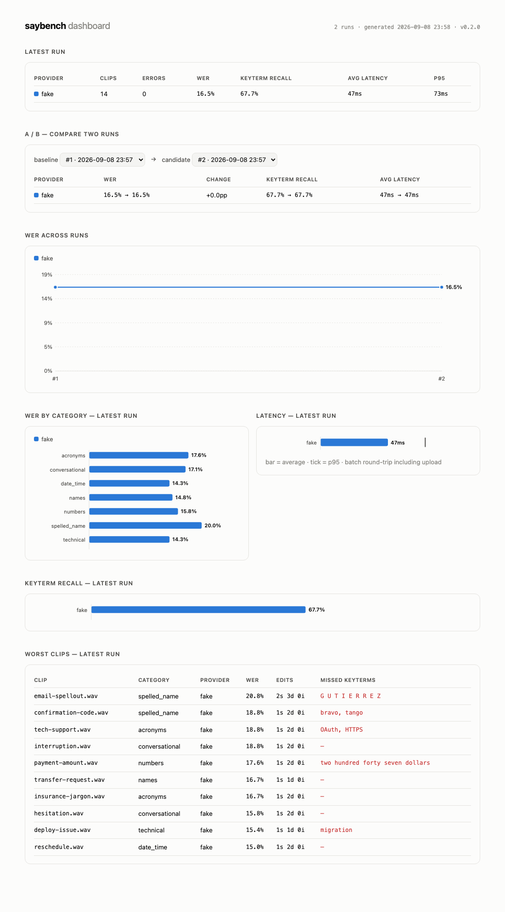

# saybench

**Benchmark speech-to-text on *your* audio, not a vendor's lab.**

Every STT vendor publishes benchmarks showing they're the fastest and most accurate. None of them ran on your audio, your accents, your jargon, or your phone-line quality — and none of them will tell you when an API update quietly makes *your* pipeline worse. saybench does: point it at your providers and your clips, get word-error-rate and latency per provider and per failure mode, and wire the regression gate into CI so a degradation fails the build before your users notice.

```
$ saybench stt -providers fake,deepgram,openai -manifest golden/manifest.jsonl -report today.json

PROVIDER                       CLIPS  ERRORS  WER    KEYTERM RECALL  AVG LATENCY  P95 LATENCY
deepgram:nova-3                14     0       3.8%   93.5%           926ms        2139ms
fake                           14     0       16.5%  67.7%           47ms         73ms
openai:gpt-4o-mini-transcribe  14     0       19.0%  74.2%           1319ms       1930ms

PROVIDER                       CATEGORY        CLIPS  WER
deepgram:nova-3                acronyms        2      8.8%
deepgram:nova-3                conversational  2      5.7%
deepgram:nova-3                date_time       2      0.0%
deepgram:nova-3                names           2      7.4%
deepgram:nova-3                numbers         2      0.0%
deepgram:nova-3                spelled_name    2      2.5%
deepgram:nova-3                technical       2      3.6%
fake                           acronyms        2      17.6%
fake                           conversational  2      17.1%
fake                           date_time       2      14.3%
fake                           names           2      14.8%
fake                           numbers         2      15.8%
fake                           spelled_name    2      20.0%
fake                           technical       2      14.3%
openai:gpt-4o-mini-transcribe  acronyms        2      0.0%
openai:gpt-4o-mini-transcribe  conversational  2      2.9%
openai:gpt-4o-mini-transcribe  date_time       2      25.7%
openai:gpt-4o-mini-transcribe  names           2      3.7%
openai:gpt-4o-mini-transcribe  numbers         2      55.3%
openai:gpt-4o-mini-transcribe  spelled_name    2      17.5%
openai:gpt-4o-mini-transcribe  technical       2      21.4%
```

*(Real output: the bundled golden set against live vendor APIs, September 2026 — plus the offline `fake` provider that runs with zero keys. Your audio will rank them differently; that is the point of the tool.)*

## What one real run teaches

That table hides a better story, which is exactly why saybench reports more than one number:

- **The headline flatters and slanders at the same time.** `gpt-4o-mini-transcribe` scores 19% overall WER — but per category it *beats* nova-3 on acronyms (0.0% vs 8.8%), names, and conversational speech. Its catastrophic categories are numbers (55.3%) and dates (25.7%) — and reading the hypotheses shows why: **it heard the digits perfectly and wrote `4739028` and `$247.63`** while the reference spells the words out. Literal WER counts formatting as error. (Deepgram has the inverse artifact: it spelled out "four hundred one" where the reference said `401`.) Text-normalization options are on the [roadmap](ROADMAP.md) precisely because of this — until then, the per-clip hypotheses in the report let you see the difference between *misheard* and *reformatted*.
- **Keyterm recall catches what WER buries.** One vendor transcribed the Kubernetes deployment as "the Cuba Needs deployment" — a 15% WER clip, but a 100% useless transcript for a technical support call. Both vendors dropped the name "Priya Raghunathan". That's the metric that decides whether a voice agent can say your customer's name back.
- **Latency is a real axis:** ~926ms vs ~1319ms average round-trip on identical clips.

## Streaming mode: the numbers a live call feels

`saybench stream` feeds your audio at **real-time pace** (50 ms PCM chunks on a wall clock) over each vendor's streaming API and measures what batch mode can't:

- **Time-to-first-partial** — first audio byte sent → first interim received. When your captions can start moving.
- **Finalization lag** — end of audio → last final segment. The dead air before your LLM can even start thinking.
- **Interim word survival** — of the final transcript's distinct words, the fraction any interim previewed. High = interims are trustworthy (safe for captions, barge-in, early LLM starts); low = the stream rewrites itself until finalization. Stated openly: append-only-delta vendors (OpenAI Realtime) score ~100% *by construction* — the metric is surfacing that their interims never lie, while replacement-hypothesis vendors (Deepgram) reveal how much they revise. Interim count ships beside it as the raw churn number.

WER, categories, and keyterm recall still score the final transcript. Streaming and batch reports carry a `mode` field, and `compare` **refuses** to compare across modes — the two latencies measure different things, and a delta between them would be a lie.

```bash
saybench stream -providers fake-stream                              # offline, zero keys
saybench stream -providers deepgram,openai-realtime,assemblyai -report stream.json
```

Real results, September 2026 — the bundled golden set, fed at real-time pace to the live APIs:

```
PROVIDER                                CLIPS  ERRORS  WER    KEYTERM RECALL  TTFP AVG  TTFP P95  FINAL LAG AVG  FINAL LAG P95
deepgram-stream:nova-3                  14     0       4.6%   90.3%           1151ms    1158ms    213ms          235ms
openai-realtime:gpt-4o-mini-transcribe  14     0       19.4%  67.7%           5633ms    7339ms    753ms          1017ms
```

**This is the measurement batch mode cannot see.** In batch, these two vendors were ~400ms apart; under streaming, the **time-to-first-partial gap is 5×** (1.15s vs 5.6s avg), and finalization lag — the dead air before your LLM can start thinking — is 3.5× apart. WER stays consistent with batch for both (the digit-vs-spelled formatting artifact included), which is a good consistency check on the pipeline. Configuration note for the OpenAI number: this run used `turn_detection: null` with an explicit end-of-audio commit — the deterministic-measurement setup; server-VAD configurations may pace deltas differently.

Streaming vendors: Deepgram live and OpenAI Realtime (transcription intent) are **live-verified** (the table above); AssemblyAI Universal-Streaming is implemented against its documented protocol and CI-tested, awaiting a live run. Each adapter is exercised in CI against a local WebSocket server speaking that vendor's dialect — the OpenAI one earned its keep on first live contact, catching a beta→GA protocol change. Every endpoint takes a URL override (`SAYBENCH_DEEPGRAM_STREAM_URL`, `SAYBENCH_OPENAI_REALTIME_URL`, `SAYBENCH_ASSEMBLYAI_STREAM_URL`) so self-hosted or compatible servers bench without code changes.

### Adding your own provider

Implement two methods — `Name()` and `StreamTranscribe(ctx, audioPath)` (or `Transcribe` for batch) — and register the spec string. `internal/provider/assemblyai_stream.go` is the smallest streaming template: dial, feed paced chunks via the shared `feed` helper, map the vendor's interim/final messages onto the shared `collector`, done. PRs welcome; the protocol test pattern in `stream_vendors_test.go` is the contract.

## LLM mode: the turn the voice loop waits on

After STT finalizes, nothing happens until the LLM's first token — TTS can't start speaking. `saybench llm` streams chat completions and measures **time-to-first-token**, completion time, and decode speed, per prompt and aggregated:

```
$ saybench llm -targets fake-llm

TARGET    PROMPTS  ERRORS  TTFT AVG  TTFT P95  COMPLETION AVG  TOK/S
fake-llm  8        0       208ms     273ms     533ms           42.6
```

**Warm by default:** every target gets one unmeasured throwaway request before the bench (`-warmup=false` to study cold starts instead) — the first live run showed cold TLS setup is a ~3× TTFT effect, and production voice agents run warm. Reports record which posture was measured, and `compare` warns when a warm run meets a cold one.

**Transport is a dimension:** `openai-ws:gpt-4o-mini` benches the same model over the Responses API's WebSocket mode — one persistent connection per target with prompts serialized over it, because connection reuse is the thing WS mode exists to provide (a fresh socket per prompt would erase what's being measured). Put both transports in one table — real run, September 2026, warm connections:

```
TARGET                 PROMPTS  ERRORS  TTFT AVG  TTFT P95  COMPLETION AVG  TOK/S
openai-ws:gpt-4o-mini  8        1       664ms     1142ms    849ms           115.6
openai:gpt-4o-mini     8        0       595ms     1103ms    762ms           109.9
```

**The honest verdict: with warm connections, WS mode buys nothing at voice-turn sizes** — SSE and WS land within ~70ms of each other (single 8-prompt run; treat as directional). The louder finding is what warmup did: the same SSE target measured **1109ms avg cold vs 595ms warm** — the transport you hold matters less than *that you hold it*. WS mode's documented wins are elsewhere (multiplexing, tool-call-heavy agentic loops), not raw single-turn TTFT. The one WS error in the table was the server cleanly reaping the persistent connection between prompts; the adapter now redials and resends once when that happens before any output (a production behavior, test-locked).

Targets are `[provider:]model` against **any OpenAI-compatible endpoint** — `openai` (default), `openrouter`, `groq`, or `custom` via `SAYBENCH_LLM_BASE_URL` (vLLM, Ollama, self-hosted — no code changes):

```bash
saybench llm -targets gpt-4o-mini,groq:llama-3.3-70b-versatile,openrouter:google/gemini-2.5-flash -report llm.json
```

Real results, September 2026 — the bundled prompt set against the live API:

```
TARGET              PROMPTS  ERRORS  TTFT AVG  TTFT P95  COMPLETION AVG  TOK/S
openai:gpt-4o-mini  8        0       1109ms    1885ms    1271ms          115.2
```

Two honest readings of that table. First, **TTFT dominates**: completion lands only ~160ms after the first token at voice-turn lengths — the wait is almost entirely time-to-first-token, which is why it's the headline column. Second, a methodological finding the per-prompt data exposed: TTFT was **bimodal (~1.7s vs ~500ms), splitting exactly along worker waves** — the first four concurrent requests paid cold TLS connection setup, the second four reused warm connections. Real voice agents hold connections warm, so a `-warmup` option (one unmeasured request per target first) is on the roadmap; until then, read cold-start p95s knowing what's in them. Benchmarks that don't tell you this are lying with averages.

The bundled `llm/golden.jsonl` is voice-agent-shaped — short system prompts, brief histories, disfluent user turns, small token caps — because that's the workload a conversation loop actually runs, not essay generation. Latency only, by design: outputs are captured in the report for reading, and quality judging is a separate roadmap item rather than a half-measure bolted onto a latency bench.

## S2S mode: benchmarking the models that replace the whole pipeline

Speech-to-speech models collapse STT → LLM → TTS into one speech-native model — and their defining number is **voice-to-voice latency**: the instant the user's turn ends until the first byte of spoken reply. `saybench s2s` feeds each golden clip as a conversational turn at real-time pace and measures exactly that, plus response-done time and how long the agent talks back:

```
$ saybench s2s -providers fake-s2s

PROVIDER  TURNS  ERRORS  V2V FIRST AUDIO AVG  V2V P95  RESPONSE DONE AVG  SPEECH OUT AVG
fake-s2s  14     0       503ms                690ms    1917ms             1217ms
```

- **Deterministic turn ending** (`turn_detection: null` + explicit commit + `response.create`), same doctrine as streaming: V2V is measured from a known instant, not the server VAD's guess. Server-VAD posture is a separate follow-up dimension, never blended in.
- **One fresh connection per clip, deliberately** — the opposite of the LLM-WS rule, for a reason: realtime sessions are stateful conversations, and separate clips must be separate conversations.
- **Agnostic by construction:** `openai` (Realtime speech-to-speech, default `gpt-realtime`, overridable) works today; **`custom` points the same OpenAI-Realtime dialect at your own endpoint** via `SAYBENCH_S2S_URL` — emerging S2S vendors clone that dialect the way everyone cloned chat completions. Anything that doesn't is a one-file adapter behind the two-method `S2SProvider` interface (Gemini Live is the named next one).
- **Phase 2 — comprehension, via echo elicitation (`-score echo`):** an S2S model never tells you what it heard, only how it replied — so the echo task instructs it to *repeat back verbatim what the caller said*, and the model's own reply transcript is scored with the same WER + keyterm machinery as everything else. The golden set's failure-mode categories become an S2S comprehension benchmark. Echo and conversational are recorded **conditions**: the report carries `s2s_scoring`, `compare` warns when they mix, and unscored runs show `—`, never 0%. Two limitations stated up front: the digit-formatting artifact applies here exactly as in batch STT (a perfect hearing may echo `4739028` against a spelled-out reference), and the scored text is the model's *own transcript of its own speech* — the metric scores the whole loop (hear → speak → self-transcribe), which is what a caller experiences anyway.

Real results, September 2026 — the golden set as live conversational turns against `gpt-realtime`:

```
PROVIDER             TURNS  ERRORS  V2V FIRST AUDIO AVG  V2V P95  RESPONSE DONE AVG  SPEECH OUT AVG
openai:gpt-realtime  14     0       601ms                1318ms   2905ms             12410ms
```

Two findings worth the run. First, **the speech-native model out-turns the pipeline it replaces**: put this table next to the others in this README and the composed stack's floor is ~808ms *before TTS even begins* (213ms streaming-STT finalization lag + 595ms warm LLM TTFT, both our own published numbers) — while `gpt-realtime`'s **first audio lands at 601ms average**. Different runs, different modes, deliberately not one merged table — and the comparison still understates the pipeline's cost because TTS time-to-first-audio (roadmap) isn't counted yet. Second, a behavioral finding latency tables usually hide: **the model talks a lot** — 12.4s average spoken reply to one-utterance turns, up to 29s, despite "respond briefly" instructions. At audio-token prices, reply length is a cost and UX axis, which is exactly why `speech out` is a first-class column.

Live echo results, September 2026:

```
PROVIDER             TURNS  ERRORS  ECHO WER  KEYTERM RECALL  V2V FIRST AUDIO AVG  V2V P95  RESPONSE DONE AVG  SPEECH OUT AVG
openai:gpt-realtime  14     0       27.0%     77.4%           638ms                1054ms   1699ms             5903ms
```

Reading that 27% honestly, the per-clip transcripts decompose it into three classes. First, the **predicted formatting artifact** ("4 7 3 9 0 2 8" echoed against a spelled-out reference — heard perfectly, scored as error). Second — the finding only this task could surface — **the model can't stop being an assistant**: told to echo "wait, before you do that, check whether the previous order shipped," it replied *"Sure thing. Let me check whether the previous order ever shipped"* — it did the thing instead of repeating it. Audio-mode instruction non-compliance is a real deployment risk, and it's invisible to every latency benchmark. Third, **where it complied, hearing was flawless**: 0.0% on the names clip, the insurance acronyms, and the technical jargon. The keyterm column carries the punchline: as a *listener*, `gpt-realtime` at **77.4% keyterm recall beats `gpt-4o-mini-transcribe`'s 74.2%** on the same golden set — while `nova-3` still leads at 93.5%. Treat the echo WER as an upper bound on mishearing, not a measurement of it — the loop includes formatting, compliance, and self-transcription, and that composite is what a caller experiences.

The `openai` S2S adapter worked on first live contact (14/14) in both phases — the mock-server tests carry both GA and beta event names, because the Realtime rename has bitten this codebase before.

## The dashboard

`saybench html -o dashboard.html run1.json run2.json ...` renders any set of reports into a **single self-contained HTML file** — no server, no CDN, no build step. Latest-run summary, A/B comparison between any two runs, WER trend across runs, per-category and latency charts, keyterm recall, and a worst-clips table with the exact missed terms. Commit it as a CI artifact and every PR gets a visual diff of its voice pipeline.



## Machine-readable everything

Every command takes `-format json` and emits the full structured result to stdout. This is deliberate: benchmarks should be consumable by **coding agents, not just humans** — an LLM debugging your voice pipeline can run `saybench stt -format json`, read the per-clip breakdown, and know *which names it garbled* before a feature ships. An MCP server mode is on the roadmap.

## Keyterm recall: the metric WER hides

A transcript can score 95% on WER and still be useless — because the 5% it missed was the customer's name, the policy number, and the callback date. Add `"keyterms": ["Beatriz Nakamura", "four seven three nine"]` to any manifest line and saybench reports **keyterm recall** separately: of the words that matter, how many survived transcription intact — with the misses named per clip.

## Why categories, not just one number

Voice agents don't fail on clean prose. They fail on **names** ("Beatriz Nakamura"), **spelled-out codes** ("B as in bravo"), **numbers** ("policy four seven three nine…"), **dates**, **acronyms**, and **disfluent real speech**. A single corpus-level WER hides exactly the failures that end calls badly. saybench reports per-category WER so you can see that a vendor which wins overall *loses on the clips that matter to you* — and the bundled golden set is organized around those failure modes.

## Install

```
go install github.com/renan-martini/saybench/cmd/saybench@latest
```

Or clone and `go build ./cmd/saybench`. Single static binary, no runtime dependencies.

## Quickstart

```bash
# 1. Zero-key smoke test with the offline fake provider and bundled corpus:
saybench stt -providers fake

# 2. Real vendors — keys come from the environment, never from files or flags:
export DEEPGRAM_API_KEY=...
export OPENAI_API_KEY=...
saybench stt -providers deepgram,openai -report baseline.json

# 3. Your own audio: write a JSONL manifest next to your clips…
#    {"audio":"clips/refund-call.wav","reference":"I want a refund for order four two nine","category":"numbers"}
saybench stt -providers deepgram -manifest my-corpus/manifest.jsonl -report today.json

# 4. Catch regressions — in CI, fail if any provider got >2 points worse:
saybench compare baseline.json today.json -max-wer-regression 2.0

# 5. Revisit any saved report, or render a set of them into a dashboard:
saybench show today.json
saybench html -o dashboard.html baseline.json today.json
```

## Providers

| Spec | Needs | Model override |
|---|---|---|
| `fake` | nothing — deterministic offline provider for CI and demos | — |
| `deepgram` | `DEEPGRAM_API_KEY` | `SAYBENCH_DEEPGRAM_MODEL` (default `nova-3`) |
| `openai` | `OPENAI_API_KEY` | `SAYBENCH_OPENAI_MODEL` (default `gpt-4o-mini-transcribe`) |

Adding a provider is one file implementing a two-method interface — see `internal/provider/provider.go` and [CONTRIBUTING.md](CONTRIBUTING.md).

## The bundled golden set

`golden/` ships 14 short clips across seven agent-failure-mode categories, synthesized with macOS text-to-speech from originally written sentences (see `golden/README.md` for provenance). It exists so the tool works out of the box and CI has a stable corpus — **your own recorded audio is always the better benchmark**, and the manifest format makes that a five-minute job.

## Honest numbers, stated plainly

- **WER is corpus-level** (total edits ÷ total reference words), with per-clip substitution/deletion/insertion breakdowns in the JSON report — a score you can debug, not just rank by.
- **Both sides are normalized** (case, punctuation) before scoring, so vendor formatting choices don't count as errors.
- **Latency here is batch-API round-trip** including upload — comparable across providers, but *not* the same as streaming time-to-first-token. Streaming latency is on the roadmap and will be reported separately, never blended.

## Roadmap

The detailed plan lives in [ROADMAP.md](ROADMAP.md). Headlines: LLM time-to-first-token against any OpenAI-compatible endpoint, **speech-to-speech model benchmarking** (voice-to-voice latency, then comprehension scoring via echo elicitation), TTS time-to-first-audio, an MCP server mode so coding agents can run benchmarks natively, a Pipecat adapter, and cost-per-hour columns.

## Design principles

- **Standard library only.** Zero runtime dependencies: nothing to audit, nothing to break, `go install` just works. A new dependency needs a reason the stdlib can't answer.
- **Keys from the environment only** — never flags, never config files, never logs. See [SECURITY.md](SECURITY.md).
- **Every network call has a deadline**; every response read is size-bounded.
- **Deterministic where possible** — the fake provider, result ordering, and report schema are all stable so diffs mean something.

## License

MIT — see [LICENSE](LICENSE).
